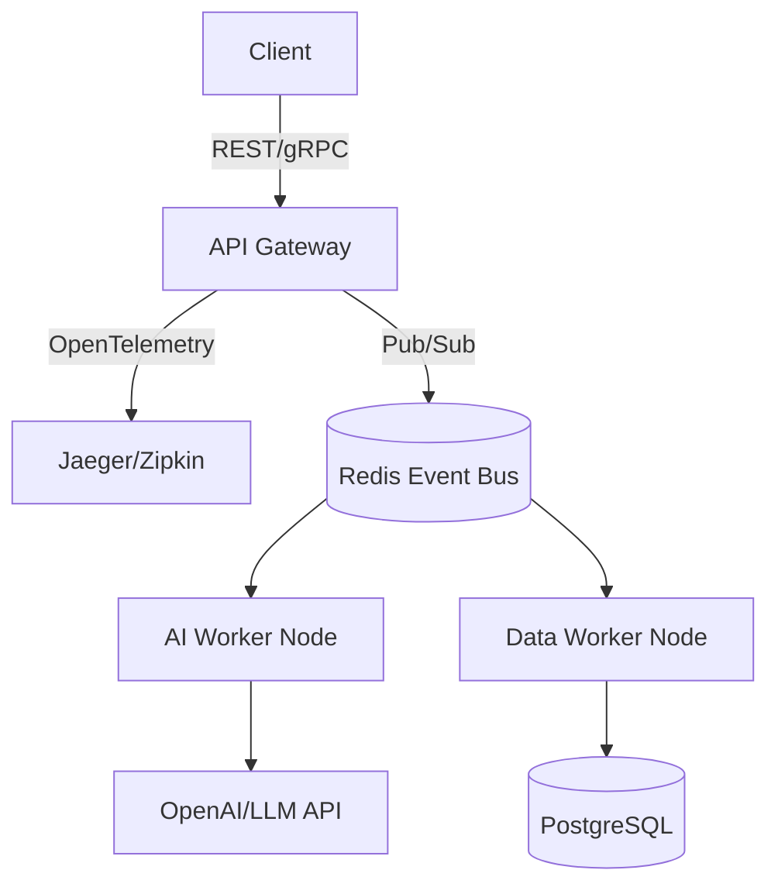

# AI-Agent-Orchestrator


A highly-scalable, event-driven orchestration layer for managing swarms of autonomous AI agents using FastAPI, Redis Pub/Sub, and OpenTelemetry.

## System Architecture





## Elite Features
- **Agentic Workflows**: Background task processing simulating LangChain/AutoGPT execution.
- **Observability**: Prometheus metrics endpoint for active agent tracking.
- **Event-Driven**: Asynchronous task dispatch and polling architecture.

## Quick Start
```bash
docker-compose up -d redis
pip install -r requirements.txt
pytest tests/ -v
uvicorn src.main:app --reload
```
